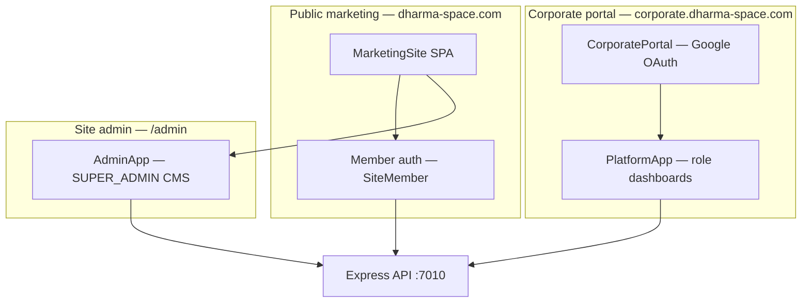
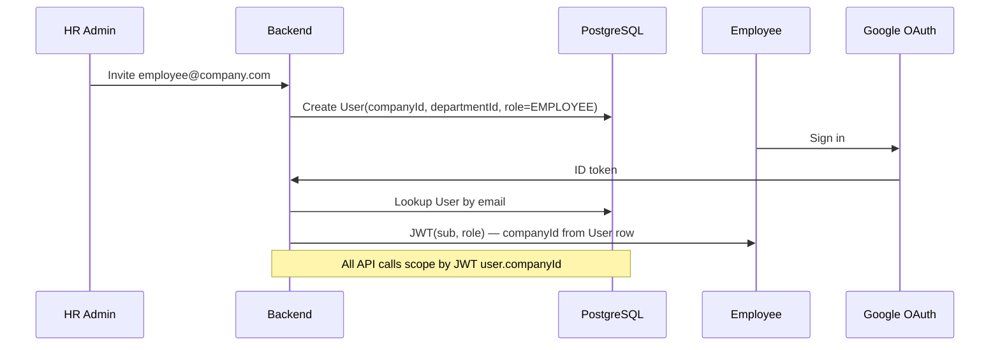

# Dharma Space — Corporate Wellness Platform & Site Architecture

> **Living document.** Update this file whenever auth, corporate platform, marketing site, or related backend/frontend behavior changes.
>
> **Last updated:** 2026-06-24 · **Latest commit:** (pending publish)

---

## How to maintain this document

1. **When to update** — Any change to: Prisma models, auth endpoints, corporate portal, member auth, marketing pages/nav, team-building CMS, **CWP wellness platform**, deployment env vars, or security/RBAC behavior.
2. **What to update** — Bump **Last updated** date, add a line to **Changelog**, and edit the affected section(s). See also [CWP-BUILD-SPEC.md](CWP-BUILD-SPEC.md) for feature phase tracking.
3. **Who updates** — Developers and Cursor agents. Read [ARCHITECTURE.md](../ARCHITECTURE.md) first.

---

## Changelog

| Date | Commit | Summary |
|------|--------|---------|
| 2026-06-24 | (local) | Google OAuth on all sign-in flows, pending user approval workflow, domain allowlist enforcement, admin email on new signups |
| 2026-05-31 | (local) | CWP Phase 1–4: wellness schema, API routes, employee dashboard, CWP Platform → corporate.dharma-space.com |
| 2026-05-31 | `a38a7b5` | Team building DB images, Corporate CWP nav submenu, specialists scroll UX, About as default on refresh |
| 2026-05-31 | `cc621b5` | Events/Education nav submenus, bundled team-building photos |
| 2026-05-31 | `7a9c075` | Unified member booking flow, schedule sorting, specialists horizontal scroll |

---

## System overview

Dharma Space runs as **three surfaces** sharing one backend:



| Surface | URL (prod) | URL (local) | Auth model | DB entity |
|---------|------------|-------------|------------|-----------|
| Marketing site | `https://dharma-space.com` | `http://localhost:7011` | Member JWT (`SiteMember`) | `SiteMember`, `Booking`, CMS models |
| Corporate wellness (CWP) | `https://corporate.dharma-space.com` | `http://corporate.localhost:7011` | Corporate JWT (`User`) + Google OAuth | `User`, `Company`, `Department` |
| Platform (password demo) | Same host as marketing (`/app`, `/hr`, …) | `localhost:7011/app/...` | Corporate JWT | `User` |
| Site CMS admin | `/admin/*` on marketing host | `localhost:7011/admin` | Corporate JWT, role `SUPER_ADMIN` | CMS + bookings admin |

---

## Frontend architecture

### Entry & routing

| File | Role |
|------|------|
| `frontend/src/main.tsx` | If `isCorporateHost()` → `CorporatePortal`, else `App` |
| `frontend/src/lib/education.ts` | `isCorporateHost()` — `corporate.*` hostname or `corporate.dharma-space.com` |
| `frontend/src/App.tsx` | Top-level React Router |

**Marketing routes** (`App.tsx`):

| Path | Behavior |
|------|----------|
| `/` | `MarketingSite` — **About** page (default) |
| `/about`, `/corporate`, `/education`, `/events` | Redirect → `/` (refresh always lands on About) |
| `/booking/success` | `MarketingSite` — Events page + Stripe return handling |
| `/login`, `/register` | Redirect → `/` |
| `/app/*`, `/hr/*`, `/trainer/*`, `/company/*` | `PlatformApp` (corporate wellness dashboards) |
| `/admin/*` | `AdminApp` (site CMS) |
| `*` | Redirect → `/` |

**In-app marketing navigation** uses React state (`page`: `about` \| `corporate` \| `education` \| `events`), not URL paths — except Stripe success on `/booking/success`.

### MarketingSite (`frontend/src/marketing/MarketingSite.tsx`)

SPA pages and nav submenus:

| Page | Sections / scroll targets |
|------|---------------------------|
| **About** | Hero, services, specialists (horizontal scroll), testimonials |
| **Corporate** | Programs, business case, team building, **Digital Platform** (`#digital-platform`), formats |
| **Education** | `#flagship-program`, `#courses-certifications`, `#workshops-intensives` |
| **Events** | `#upcoming-events`, `#regular-classes` |

**Nav submenus** (desktop: CSS hover; mobile: expandable):

| Nav item | Submenu item | Scroll target |
|----------|--------------|---------------|
| Corporate | CWP Platform | External → `https://corporate.dharma-space.com` (local: `http://corporate.localhost:7011`) |
| Education | Flagship Program | `#flagship-program` |
| Education | Courses & Certifications | `#courses-certifications` |
| Education | Workshops & Intensives | `#workshops-intensives` |
| Events | Upcoming Events | `#upcoming-events` |
| Events | Regular Classes | `#regular-classes` |

**Modals:** Contact, Member account, Reserve, Class booking, Stripe success, Admin login (username `admin`).

**Team building (Corporate page):** Loads from API `site.teamActivities` with static fallback in `frontend/src/marketing/assets.ts`. Custom photos restored from bundled files on deploy.

### Corporate portal (`frontend/src/corporate/CorporatePortal.tsx`)

1. If `localStorage` has `hsos_token` + `hsos_user` and role ∈ `{EMPLOYEE, HR_ADMIN, CORPORATE_ADMIN, SUPER_ADMIN}` → render `PlatformApp`.
2. Else fetch `GET /api/auth/google/config` for Google `clientId`.
3. Google sign-in → `POST /api/auth/google` → store token → redirect to `user.homePath`.

**Note:** `TRAINER` is not admitted via corporate subdomain Google login.

### PlatformApp (`frontend/src/platform/PlatformApp.tsx`)

Role-based routes:

| Prefix | Roles | Example paths |
|--------|-------|---------------|
| `/app/*` | `EMPLOYEE` | `/app/dashboard`, `/app/events`, `/app/bookings`, `/app/statistics` |
| `/hr/*` | `HR_ADMIN`, `CORPORATE_ADMIN`, `SUPER_ADMIN` | `/hr/dashboard`, `/hr/employees`, `/hr/events` |
| `/trainer/*` | `TRAINER`, `SUPER_ADMIN` | `/trainer/dashboard`, `/trainer/events` |
| `/company/*` | `CORPORATE_ADMIN`, `SUPER_ADMIN` | `/company/dashboard`, `/company/events` |

**Default home paths** (match backend `roleHome`):

| Role | `homePath` |
|------|------------|
| `EMPLOYEE` | `/app/dashboard` |
| `HR_ADMIN` | `/hr/dashboard` |
| `TRAINER` | `/trainer/dashboard` |
| `CORPORATE_ADMIN` | `/company/dashboard` |
| `SUPER_ADMIN` | `/admin` |

### Member auth (marketing)

| File | Role |
|------|------|
| `frontend/src/auth/MemberAuthContext.tsx` | Session context |
| `frontend/src/lib/member-api.ts` | API client |
| `frontend/src/components/MemberAuthPanel.tsx` | Login/register UI |
| `frontend/src/components/MemberAccountModal.tsx` | Account + bookings |

| Storage key | Purpose |
|-------------|---------|
| `dharma_member_token` | Member JWT |
| `dharma_member` | Member profile JSON |

Separate from corporate keys `hsos_token` / `hsos_user`.

### Admin CMS (`frontend/src/admin/AdminApp.tsx`)

Requires `SUPER_ADMIN`. Manages trainers, class schedule, programs/events, bookings, inquiries.

---

## Backend architecture

### Stack

- **Runtime:** Node.js, Express, TypeScript
- **ORM:** Prisma → PostgreSQL
- **Auth:** JWT (7 days corporate, 30 days member), bcrypt (cost 12)
- **Ports:** Backend `7010`, frontend dev `7011`

### Prisma models

**File:** `backend/prisma/schema.prisma`

#### Corporate wellness (CWP)

| Model | Purpose | Key fields |
|-------|---------|------------|
| `User` | Platform users | `email`, `passwordHash`, `role`, `companyId?`, `departmentId?` |
| `Company` | Corporate customer | `name`, `industry`, `plan`, `seats` |
| `Department` | Org unit | `name`, `companyId` |
| `Course`, `Module`, `Session` | Learning content | Instructor, enrollments |
| `Enrollment`, `Attendance` | Progress tracking | `userId`, `courseId` |
| `WellbeingCheckin` | Employee wellbeing | Mood, stress, energy, private note |
| `Challenge`, `ChallengeParticipation` | Company challenges | `companyId` |
| `Certificate`, `UserBadge` | Gamification | User achievements |
| `Invoice` | Billing | `companyId`, `amount`, `status` |

#### Public marketing site

| Model | Purpose |
|-------|---------|
| `SiteMember` | Public booking accounts (not linked to `User`) |
| `SiteTrainer` | Specialist profiles on About page |
| `SiteClass` | Regular class schedule |
| `SiteProgram` | Education programs, events, workshops |
| `SiteTeamActivity` | Corporate page team-building cards |
| `Booking` | Member bookings (programs/classes) |

**Important:** `SiteMember` and `User` are **separate** identity systems.

### Roles

| Role | Google corporate login | Platform access |
|------|------------------------|-----------------|
| `EMPLOYEE` | Yes | `/app/*` |
| `HR_ADMIN` | Yes | `/hr/*` |
| `CORPORATE_ADMIN` | Yes | `/company/*`, `/hr/*` |
| `TRAINER` | No (password only) | `/trainer/*` |
| `SUPER_ADMIN` | Yes | All + `/admin/*` |

Defined in `backend/src/google-auth.ts` (`CORPORATE_ROLES`) and enforced in `backend/src/server.ts` (`requireRole`).

### Auth endpoints

#### Corporate platform (`User`)

| Method | Path | Auth | Behavior |
|--------|------|------|----------|
| `POST` | `/api/auth/register` | None | Creates user; defaults `EMPLOYEE`, first company/dept |
| `POST` | `/api/auth/login` | None | Email/password; `admin` → `admin@dharma-space.com` |
| `GET` | `/api/auth/google/config` | None | Returns `clientId`, `corporateUrl` |
| `POST` | `/api/auth/google` | None | Google ID token → JWT; user must pre-exist with corporate role |
| `GET` | `/api/auth/me` | Bearer JWT | Sanitized user + `homePath` |

**JWT payload:** `{ sub: userId, role }` · **Expiry:** 7 days

**Google auth flow** (`backend/src/google-auth.ts`):

- Verifies ID token against `GOOGLE_CLIENT_ID`
- Requires `email_verified`
- Looks up `User` by email — **no auto-provision** for disallowed domains; allowed domains create `PENDING` user
- `corporateDomainAllowed(email)` enforced on **self-signup** (`POST /api/auth/register`, new Google accounts)
- Admin notification email to `MAIL_CORPORATE_INBOX` (+ `MAIL_NOTIFY` CC) when a pending user is created

#### Marketing members (`SiteMember`)

| Method | Path | Auth |
|--------|------|------|
| `POST` | `/api/member/register` | None |
| `POST` | `/api/member/login` | None |
| `GET` | `/api/member/me` | Member JWT |
| `PATCH` | `/api/member/me` | Member JWT |
| `GET` | `/api/member/offerings` | None |
| `GET` | `/api/member/bookings` | Member JWT |
| `POST` | `/api/member/bookings` | Member JWT |
| `POST` | `/api/member/bookings/confirm-return` | Member JWT |

**JWT payload:** `{ sub, kind: "site_member" }` · **Expiry:** 30 days

**Implementation:** `backend/src/site-bookings.ts`

#### Site admin bookings

| Method | Path | Role |
|--------|------|------|
| `GET` | `/api/admin/bookings/overview` | `SUPER_ADMIN` |
| `GET` | `/api/admin/bookings` | `SUPER_ADMIN` |
| `POST` | `/api/admin/bookings/:id/mark-paid` | `SUPER_ADMIN` |
| `PATCH` | `/api/admin/bookings/:id/cancel` | `SUPER_ADMIN` |
| `POST` | `/api/admin/bookings/:id/refund` | `SUPER_ADMIN` |

### Company-scoped API routes

Helper: `companyUserIds(user)` — employees (`role: EMPLOYEE`) in same `companyId`.

| Method | Path | Roles | Scoping |
|--------|------|-------|---------|
| `GET` | `/api/wellbeing/company-aggregate` | HR, CORPORATE_ADMIN, SUPER_ADMIN | Same-company employees |
| `GET` | `/api/hr/dashboard` | HR, CORPORATE_ADMIN, SUPER_ADMIN | Company filter |
| `GET` | `/api/hr/departments` | HR, CORPORATE_ADMIN, SUPER_ADMIN | `companyId` |
| `GET` | `/api/challenges` | Authenticated | `companyId` unless SUPER_ADMIN |
| `POST` | `/api/challenges` | HR, CORPORATE_ADMIN, SUPER_ADMIN | `req.body.companyId \|\| req.user.companyId` |
| `GET` | `/api/company/dashboard` | CORPORATE_ADMIN, SUPER_ADMIN | `req.user.companyId` |

Employee-scoped (by `req.user.id`): `/api/employee/dashboard`, `/api/enrollments/*`, `/api/wellbeing/me`, `/api/certificates/me`.

### Public site content API

| Method | Path | Notes |
|--------|------|-------|
| `GET` | `/api/site/content` | Trainers, classes, programs, team activities |
| `GET` | `/api/media/trainers/:id/:file` | Trainer photos |
| `GET` | `/api/media/programs/:id/:file` | Program images |
| `GET` | `/api/media/team-building/:id/:file` | Team activity images |

**Team building persistence:** `backend/src/team-building.ts` — `SiteTeamActivity` model, bundled images in `backend/data/team-building-images/`, restored on startup via `restoreBundledTeamBuildingImages()` in `seed-site.ts`.

Bundled custom images (as of `a38a7b5`):

| Activity title | Bundled file |
|----------------|--------------|
| Aerial Sound Bath | `aerial-sound-bath.jpg` |
| Learning Handpan Class | `learning-handpan-class.jpg` |
| Healthy Meals Cooking Classes | `healthy-meals-cooking-class.jpg` |

### Seed data

| File | Contents |
|------|----------|
| `backend/prisma/seed.ts` | 5 demo companies, departments, 30+ users, courses, wellbeing, challenges |
| `backend/prisma/seed-site.ts` | Marketing CMS, team activities, `ensureSiteAdmin()` |

**Demo password (all seed users):** `password123`

| Email | Role |
|-------|------|
| `employee@demo.com` | EMPLOYEE |
| `hr@demo.com` | HR_ADMIN |
| `trainer@demo.com` | TRAINER |
| `company@demo.com` | CORPORATE_ADMIN |
| `admin@demo.com` | SUPER_ADMIN |

**Production site admin:** `admin@dharma-space.com` from `SITE_ADMIN_PASS` (default `admin`), created at startup.

---

## Environment variables

**Template:** `backend/.env.example`

| Variable | Purpose |
|----------|---------|
| `DATABASE_URL` | PostgreSQL connection |
| `JWT_SECRET` | Signs corporate + member JWTs |
| `PORT` | Backend port (7010 local) |
| `FRONTEND_URL` | CORS + links |
| `GOOGLE_CLIENT_ID` | Corporate Google OAuth |
| `CORPORATE_ALLOWED_DOMAINS` | Domain allowlist for self-signup (default `dharma-space.com`) — enforced on register + new Google signups |
| `CORPORATE_URL` | Corporate portal URL |
| `SITE_ADMIN_PASS` | Marketing header admin password |
| `SMTP_*` | Education + corporate inquiry emails |
| `STRIPE_*` | Card/PayNow bookings |
| `SGAI_API_KEY` | Trainer bio import (admin) |

**Google OAuth authorized origins (configure in Google Cloud Console):**

- `https://corporate.dharma-space.com`
- `http://localhost:7011`
- `http://corporate.localhost:7011`

---

## Security — current state

### What works today

| Control | Detail |
|---------|--------|
| Invite-only Google login | User must exist in DB with corporate role |
| Email verification | Google `email_verified` required |
| Role middleware | `requireRole(...)` on sensitive routes |
| Company scoping | HR dashboard, departments, wellbeing aggregate filter by `companyId` |
| Separate member auth | `kind: "site_member"` on member JWT routes |
| Password hashing | bcrypt cost 12 |
| Privacy | HR aggregate excludes individual wellbeing notes |

### Known gaps (roadmap)

| Priority | Gap | Recommended fix |
|----------|-----|-----------------|
| **P0** | Open `POST /api/auth/register` accepts arbitrary role | ~~Disable in prod or restrict to invite token~~ — register forces `EMPLOYEE` + `PENDING` + domain allowlist |
| **P0** | `corporateDomainAllowed()` not used | ~~Enforce per-company domains on Google login~~ — enforced on self-signup |
| **P1** | No employee invite flow | Add `EmployeeInvite` model + HR invite API |
| **P1** | No per-company domain on `Company` | Add `allowedDomains String[]` to schema |
| **P1** | Challenge/certificate IDOR | Verify `companyId` / ownership on mutations |
| **P2** | JWT in localStorage | Consider httpOnly cookies for corporate portal |
| **P2** | Shared `JWT_SECRET` for both auth types | Separate secrets or strict payload validation |
| **P2** | No token revocation | Short-lived tokens + refresh, or session store |
| **P2** | `companyUserIds()` excludes HR from aggregates | Document or expand scope per product need |

---

## Employee ↔ company tracking (target model)

How to know **exact employee from exact company**:



### Recommended build order

1. **Per-company allowed domains** on `Company` + enforce in `/api/auth/google`
2. **HR invite API** — email list → pending invite → accept → create `User` with fixed `companyId`
3. **Seat limits** — block invites when `users.count >= company.seats`
4. **Department assignment** at invite time
5. **Audit log** — `login`, `booking`, `attendance` events keyed to `userId` + `companyId`
6. **Enterprise SSO** (SAML/OIDC) when a client requires it

### Proposed schema additions (not yet implemented)

```prisma
model Company {
  // existing fields...
  allowedDomains  String[]  // e.g. ["acme.com", "acme.sg"]
  ssoProvider     String?   // "google" | "microsoft" | "saml"
  ssoTenantId     String?
}

model EmployeeInvite {
  id           String    @id @default(cuid())
  companyId    String
  email        String
  departmentId String?
  role         String    @default("EMPLOYEE")
  token        String    @unique
  expiresAt    DateTime
  acceptedAt   DateTime?
  createdAt    DateTime  @default(now())
}
```

---

## Key file index

### Backend

| Path | Purpose |
|------|---------|
| `backend/prisma/schema.prisma` | All data models |
| `backend/prisma/seed.ts` | Corporate demo data |
| `backend/prisma/seed-site.ts` | Marketing CMS + team activity restore |
| `backend/src/server.ts` | Main API, auth, RBAC, dashboards |
| `backend/src/google-auth.ts` | Google OAuth helpers |
| `backend/src/pending-user-notifications.ts` | Pending signup admin email + domain helpers |
| `backend/src/site-bookings.ts` | Member auth + bookings |
| `backend/src/site-content.ts` | Public CMS API |
| `backend/src/team-building.ts` | Team activity defaults + image restore |
| `backend/src/team-building-media-cache.ts` | Uploaded team image storage |
| `backend/data/team-building-images/` | Bundled source photos (committed) |
| `backend/.env.example` | Environment template |

### Frontend

| Path | Purpose |
|------|---------|
| `frontend/src/main.tsx` | Corporate subdomain switch |
| `frontend/src/App.tsx` | Router |
| `frontend/src/corporate/CorporatePortal.tsx` | Google OAuth entry |
| `frontend/src/components/GoogleSignIn.tsx` | Shared Google sign-in button |
| `frontend/src/platform/PlatformApp.tsx` | CWP dashboards |
| `frontend/src/marketing/MarketingSite.tsx` | Public marketing SPA |
| `frontend/src/marketing/assets.ts` | Static marketing assets |
| `frontend/src/styles/marketing.css` | Nav submenus, specialists scroll |
| `frontend/src/admin/AdminApp.tsx` | Site CMS |
| `frontend/src/auth/MemberAuthContext.tsx` | Member session |
| `frontend/src/lib/site-content.ts` | Site content types + fetch |
| `frontend/src/lib/member-api.ts` | Member API client |
| `frontend/vite.config.ts` | Dev proxy `/api` → `:7010` |

### Deployment

| Path | Purpose |
|------|---------|
| `.do/app.yaml` | DigitalOcean backend spec |
| `.do/live-spec.yaml` | Production env reference |
| `README.md` | Quick start + demo accounts |

---

## Local development

```bash
npm install
docker compose up -d db
cp backend/.env.example backend/.env
npm run db:push
npm run seed
npm run dev
```

| URL | What |
|-----|------|
| `http://localhost:7011` | Marketing site (About default) |
| `http://corporate.localhost:7011` | Corporate portal (Google login) |
| `http://localhost:7010` | API |
| `http://localhost:7011/admin` | Site CMS (admin / SITE_ADMIN_PASS) |

---

## Related documents

- `README.md` — Quick start, demo accounts, deployment
- `backend/.env.example` — Full env var list
